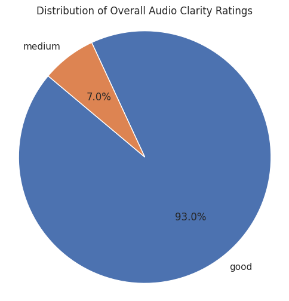

# TikTok Food Review Video Analysis

## Overview

This project analyzes viral TikTok food review videos from Vietnam (2022-2023) to identify common elements and understand viewer preferences. Using a mixed-methods approach combining content analysis and survey data, we examine what components contribute to video virality on the platform.

## Research Questions

1. What elements are commonly found in TikTok food review videos that went viral in 2022-2023?
2. To what extent do these elements influence viewer preferences in viral TikTok food review videos?

## Dataset

- **Video Analysis**: 130 viral TikTok food review videos
- **Survey Data**: 45 respondent responses on viewing preferences
- **Features**: 25+ video components across 4 categories (Text-Transcript, Audio-Transcript, Visual, Audio)

## Methodology

### Data Collection
- Systematic identification and annotation of viral TikTok food review content
- Manual video annotation across multiple component categories
- Consumer preference survey distribution and collection

### Analysis Framework
The analysis categorizes video components into four main types:

**Text-Transcript Components (6 features):**
- Food/cuisine names
- Descriptive adjectives
- Brand mentions
- Location references
- Price mentions
- Ingredient descriptions

**Audio-Transcript Components (4 features):**
- Flavor descriptions
- Space/environment descriptions
- Social interactions
- Reviewer presence

**Visual Components (6 features):**
- Food presence
- Reviewer visibility
- Food preparation process
- Location shots
- Background elements
- Camera shot types

**Audio Components (6 features):**
- Background music
- Reviewer voice
- Eating sounds
- Cooking sounds
- External audio
- Overall audio clarity

## Key Findings

### Most Common Components in Viral Videos


- **Food Presence**: 99.22% of videos
- **Reviewer's Voice**: 98.45% of videos  
- **Reviewer Presence**: 96.12% of videos
- **Descriptive Food Language**: 95.35% of videos

### Component Category Analysis


Comprehensive comparison of all components across the four main categories (Text-Transcript, Audio-Transcript, Visual, Audio), showing the relative frequency distribution of each element in viral videos.

**Text-Transcript Components:**
- Food name appearances: 57.36%
- Ingredient mentions: 62.79%
- Location mentions: 38.76%

**Visual Components:**
- Food preparation process: 58.91%
- Location presence: 65.89%
- Background elements: 43.41%

**Audio Components:**
- Background music presence varies significantly
- Cooking sounds: 2.33% (least common)
- Eating sounds: 13.95%

### Audio Quality Analysis



Distribution of overall audio clarity ratings across the video dataset, showing the quality standards of viral content.

### Transcript Component Analysis


Frequency analysis of specific transcript elements that appear in viral food review videos, highlighting the importance of descriptive language and food-related terminology.

### Survey Results - Viewer Preferences


**Highest Rated Elements:**
- Video Quality: 8.53/10
- Food Filming Styles: 8.48/10
- Food-related Keywords: 7.39/10
- Location Keywords: 7.23/10


### Hashtag Analysis

Most frequently used hashtags in viral videos:
- `#reviewanngon`: 58 occurrences
- `#AnCungTikTok`: 51 occurrences  
- `#ancungtiktok`: 35 occurrences
- `#learntiktok`: 23 occurrences

### Viewing Patterns


## Technical Implementation

### Dependencies
```python
import pandas as pd
import matplotlib.pyplot as plt
import seaborn as sns
import numpy as np
```

### Data Processing Pipeline

1. **Data Loading & Cleaning**
   ```python
   # Load annotation data
   df = pd.read_excel("Annotation.xlsx")
   df.columns = df.iloc[0]
   data_clean = df[1:].head(129)
   ```

2. **Component Categorization**
   ```python
   # Separate component categories
   trans_comp = binary_component_col[binary_component_col.columns[:6]]
   audiotrans_comp = binary_component_col[binary_component_col.columns[6:10]]
   visual_comp = binary_component_col[binary_component_col.columns[10:16]]
   audio_comp = binary_component_col[binary_component_col.columns[16:22]]
   ```

3. **Statistical Analysis**
   ```python
   # Calculate frequencies and percentages
   counts = binary_component_col.sum(axis=0)
   percentage = (counts / len(binary_component_col)) * 100
   ```

4. **Visualization Generation**
   ```python
   # Dual-axis frequency and percentage plots
   fig, ax1 = plt.subplots(figsize=(10, 5))
   counts.plot(kind='bar', color='blue', ax=ax1)
   ax2 = ax1.twinx()
   percentage.plot(kind='bar', color='red', ax=ax2, alpha=0.3)
   ```

### Analysis Features

- **Descriptive Statistics**: Mean, median, standard deviation for all components
- **Frequency Analysis**: Component occurrence rates across video dataset  
- **Distribution Analysis**: Box plots and histograms for survey responses
- **Comparative Analysis**: Cross-category component comparison
- **Visualization Suite**: Bar charts, stacked charts, pie charts, box plots

## File Structure

```
├── tiktok_videos_analysis.py    # Main analysis script
├── Annotation.xlsx              # Video annotation dataset (130 videos)
├── Survey3.xlsx                 # Survey response data (45 responses)  
├── tiktok_analysis_output.pdf   # Code execution outputs
├── images/                      # Generated visualizations
│   ├── component_frequency_chart.png
│   ├── category_comparison_stacked.png
│   ├── audio_clarity_pie_chart.png
│   ├── transcript_components_frequency.png
│   ├── survey_mean_scores.png
│   ├── survey_boxplots.png
│   ├── viewing_frequency.png
│   └── viewing_timeframes.png
└── README.md
```

## Results Summary

The analysis reveals that successful viral TikTok food review videos consistently include:

1. **Visual Elements**: Clear food presentation (99.22%) and visible reviewers (96.12%)
2. **Audio Quality**: Strong reviewer narration (98.45%) and clear audio
3. **Content Strategy**: Descriptive food language (95.35%) and strategic hashtag use
4. **Viewer Preferences**: High video quality and engaging food cinematography are most valued

These findings provide data-driven insights for content creators and digital marketers in the food and beverage industry looking to optimize their TikTok presence.

## Usage

1. Install required dependencies:
   ```bash
   pip install pandas matplotlib seaborn numpy openpyxl
   ```

2. Run the analysis:
   ```bash
   python tiktok_videos_analysis.py
   ```

3. View generated visualizations in the `images/` directory

## Contributing

This project was developed as part of a research study on social media content virality. The analysis framework can be adapted for other content types or platforms.

## License

This project is for academic and research purposes.
